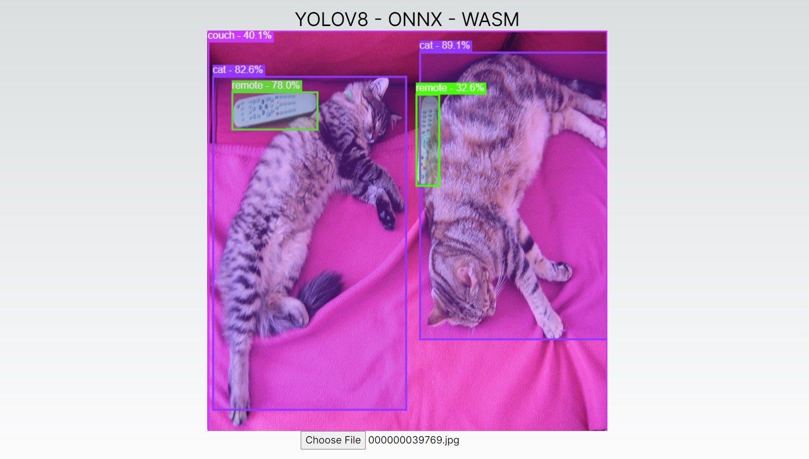

# Deploy YOLOV8 ONNX Model in Browser
Aim is to deploy Yolov8 model by first converting it to ONNX format and then deploying in browser using WASM.

## Create YOLOV8 ONNX model
1. Install Requirements  
"`pip install -r requirements.txt`"
2. Install libgl1 library  
"`sudo apt update && sudo apt install libgl1`"
3. Download YOLOV8 pytorch model and Convert it to ONNX
```
from ultralytics import YOLO

# Load a model
model = YOLO('yolov8n.pt')  # load an official model

# Export the model
model.export(format='onnx')
```

## Frontend
1. To create and initialize the new application, run inside the terminal:  
`npx create-next-app@latest`

2. Give you project a name and answer yes/no against listed features. Your project application folder will be created with default settings.

3. Now, create `model` folder inside public folder of your application and move onnx models (yolov8 and nms-yolov8) inside it.

4. Update `page.tsx` file with new code.

5. Run `npm run dev` to start the application.

## Sample test

